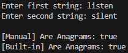

# Check if Two Strings Are Anagrams in Dart

---

## Overview

This Dart program checks if two strings are **anagrams**.

**What is an anagram?**  
It’s a word made by rearranging the letters of another word.  
Example: `listen` ➔ `silent`

---

## Objective

I made two versions:

1 **Manual way** (I don’t use Dart’s built-in sort or tools).  
2 **Built-in way** (I use Dart’s built-in functions).

---

## Functional Details

### Phase 1 – Manual Way

This function checks if two words are anagrams **without using Dart’s built-in tools**.

**How it works:**
- I count each letter in the first word using a `Map`.
- Then I subtract counts for each letter in the second word.
- If everything matches (no letters left over), they are anagrams.

---

### Phase 2 – Built-in Way

This function uses Dart’s built-in functions like `split()` and `sort()`.

**How it works:**
- I split the words into letters.
- I sort both lists of letters.
- I join them back and compare.

---

## Algorithm Analysis

### Manual Way

**Steps:**
- I go through the first word and count each letter.
- I go through the second word and reduce the counts.
- If all counts are zero, it’s an anagram.

**Time:**
- O(n) (n = length of the word)

**Space:**
- O(k) (k = number of unique letters)

---

### Built-in Way

**Steps:**
- I split both words into letters.
- I sort both.
- I compare the sorted words.

**Time:**
- O(n log n)

**Space:**
- O(n)

---

## Comparison

| What                     | Manual Way                      | Built-in Way               |
|--------------------------|----------------------------------|----------------------------|
| Code complexity          | Medium (needs some logic)        | Very simple                |
| Speed                    | Faster (O(n))                    | Slower (O(n log n))        |
| Easy to understand?      | Needs a bit of thinking          | Very easy to read          |
| Best for                 | Big/fast tasks                   | Small/quick tasks          |

---

## Sample Output

This is what the program shows:

