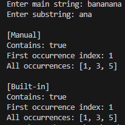

## 🔎 Algorithm Analysis

### Manual Implementation

**How it works:**
- We use two loops:
  - Outer loop: moves from 0 to (sentence length - word length).
  - Inner loop: checks each letter of the word with the sentence.

**Time Complexity:**
O(n * m)
- n = length of sentence
- m = length of word

**Space Complexity:**
- O(1) for `containsSubstringManual` & `firstOccurrenceManual`
- O(k) for `allOccurrencesManual` (k = number of matches)

---

### Built-in Implementation

**How it works:**
- Uses Dart’s built-in methods like `.contains()`, `.indexOf()`.
- Loops with `.indexOf()` to find all matches.

**Time Complexity:**
- `.contains()`: O(n)
- `.indexOf()`: O(n)
- `allOccurrencesBuiltIn`: O(n * k)

**Space Complexity:**
O(1) or O(k)

---

## Comparison

| Aspect                  | Manual                         | Built-in                      |
|-------------------------|--------------------------------|-------------------------------|
| Code complexity         | More complex                   | Very simple                   |
| Performance             | Slower (O(n * m))              | Faster (optimized, O(n))      |
| Readability             | Good for learning              | Very clear and short          |
| Best use case           | For learning algorithms        | For real/production use       |

---

## Sample Output

Here is the result of running the program:

